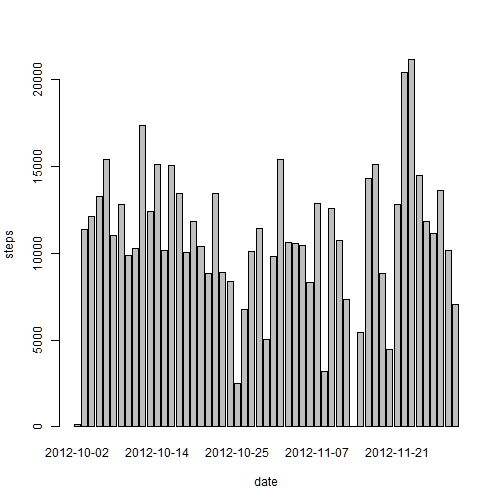
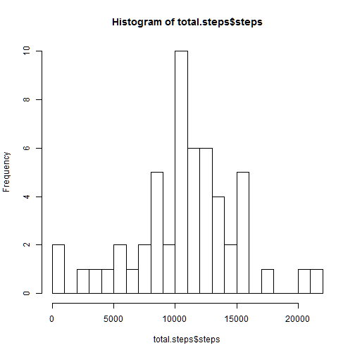
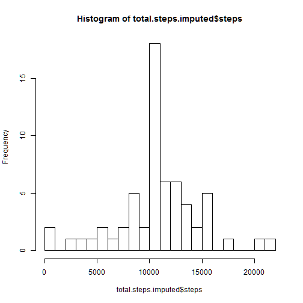
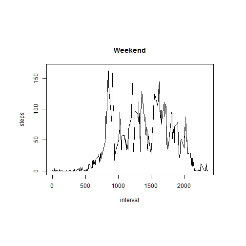
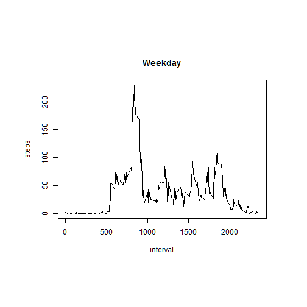

# Reproducible Research: Week 2 Project (Project 1)

## Loading (from original internet source) and preprocessing the data

```r
temp <- tempfile()
download.file("http://d396qusza40orc.cloudfront.net/repdata%2Fdata%2Factivity.zip",temp)
```

```
## Warning in
## download.file("http://d396qusza40orc.cloudfront.net/repdata%2Fdata%2Factivity.zip",
## : downloaded length 53559 != reported length 53559
```

```r
data <- read.csv(unz(temp, "activity.csv"))
unlink(temp)
```

## What is mean total number of steps taken per day?
### Highly ambiguous IMO, First plot below shows total steps taken on *each day* of the trial period


```r
data$date <- as.Date(data$date)

total.steps <- aggregate(steps ~ date, data = data, FUN = sum)
barplot(total.steps$steps, names.arg = total.steps$date, xlab = "date", ylab = "steps")
```

 

### Alternatively, this histogram is what has been referred to in the discussion forums. Mean and Median are shown here below.


```r
hist(total.steps$steps, breaks=20)
```

 

```r
mean(total.steps$steps, na.rm=TRUE)
```

```
## [1] 10766.19
```

```r
median(total.steps$steps, na.rm=TRUE)
```

```
## [1] 10765
```

## What is the average daily activity pattern?
### Make a time series plot (i.e. type = "l") of the 5-minute interval (x-axis) and the average number of steps taken, averaged across all days (y-axis)


```r
steps.interval <- aggregate(steps ~ interval, data = data , FUN = mean)
plot(steps.interval, type = "l")
```

 

### On average across all the days in the dataset, which 5-minute interval contains the maximum number of steps?

```r
steps.interval$interval[which.max(steps.interval$steps)]
```

```
## [1] 835
```

## Imputing missing values

### Calculate and report the total number of missing values in the dataset (i.e. the total number of rows with NAs)
### True will be the number of NAs


```r
table(is.na(data))
```

```
## 
## FALSE  TRUE 
## 50400  2304
```

### let's use the number of steps taken per interval, averaged over all days to replace the NAs'


```r
substitute_NAs <- aggregate(steps ~ interval, data, mean, na.action = na.omit)$steps
```

### And then create a new (copy) of the dataset with the NAs filled in 


```r
imputedNAs <- transform(data, steps = ifelse(is.na(data$steps), substitute_NAs, data$steps))
# let'd do a quick check to see that it worked !

head(imputedNAs)
```

```
##       steps       date interval
## 1 1.7169811 2012-10-01        0
## 2 0.3396226 2012-10-01        5
## 3 0.1320755 2012-10-01       10
## 4 0.1509434 2012-10-01       15
## 5 0.0754717 2012-10-01       20
## 6 2.0943396 2012-10-01       25
```

```r
## so we can see the first few NAs have been replaced

str(imputedNAs)
```

```
## 'data.frame':	17568 obs. of  3 variables:
##  $ steps   : num  1.717 0.3396 0.1321 0.1509 0.0755 ...
##  $ date    : Date, format: "2012-10-01" "2012-10-01" ...
##  $ interval: int  0 5 10 15 20 25 30 35 40 45 ...
```

```r
table(is.na(imputedNAs))
```

```
## 
## FALSE 
## 52704
```

```r
## All false, so all of the NAs are gone!
```

## Using the new data now (with NAs replaced)
### What are the total steps on this new data ?


```r
total.steps.imputed <- aggregate(steps ~ date, data = imputedNAs, FUN = sum)

hist(total.steps.imputed$steps, breaks=20)
```

 

```r
mean(total.steps.imputed$steps, na.rm=TRUE)
```

```
## [1] 10766.19
```

```r
median(total.steps.imputed$steps, na.rm=TRUE)
```

```
## [1] 10766.19
```

Comparing the results before and after the replacedment of NAs we can see

* The mean before was 10766.19 and it is exactly the same after the replacement
* The median before was 10765 and it is now 10766.19 (slightly higher)
* Mean and median in this replacement data set are equivalent

Clearly there will have been an impact on Total steps

```r
sum(data$steps,na.rm=T)
```

```
## [1] 570608
```

```r
# total steps in the original data set

sum(total.steps.imputed$steps)
```

```
## [1] 656737.5
```

```r
# total steps in the new data set
```

So there were 570608 originally and there are now 656737.5 .. i.e. an increase. To be expected !

# Are there differences in activity patterns between weekdays and weekends?

For this part the weekdays() function may be of some help here. Use the dataset with the filled-in missing values for this part.

1. Create a new factor variable in the dataset with two levels - "weekday" and "weekend" indicating whether a given date is a weekday or weekend day.

2. 
Make a panel plot containing a time series plot (i.e. type = "l") of the 5-minute interval (x-axis) and the average number of steps taken, averaged across all weekday days or weekend days (y-axis). See the README file in the GitHub repository to see an example of what this plot should look like using simulated data.


```r
# work out the day and add it to the new data set
imputedNAs$day <- weekdays(imputedNAs$date)

imputedNAs$Weekend <- grepl("^S", imputedNAs$day) # Weekend days start with a capital S, no weekdays do

# now lets add as a factor with two levels as per the requirement

imputedNAs$dayType <- factor(imputedNAs$Weekend, levels = c(F, T), labels = c("Weekday", "Weekend"))

summary(imputedNAs)
```

```
##      steps             date               interval          day           
##  Min.   :  0.00   Min.   :2012-10-01   Min.   :   0.0   Length:17568      
##  1st Qu.:  0.00   1st Qu.:2012-10-16   1st Qu.: 588.8   Class :character  
##  Median :  0.00   Median :2012-10-31   Median :1177.5   Mode  :character  
##  Mean   : 37.38   Mean   :2012-10-31   Mean   :1177.5                     
##  3rd Qu.: 27.00   3rd Qu.:2012-11-15   3rd Qu.:1766.2                     
##  Max.   :806.00   Max.   :2012-11-30   Max.   :2355.0                     
##   Weekend           dayType     
##  Mode :logical   Weekday:12960  
##  FALSE:12960     Weekend: 4608  
##  TRUE :4608                     
##  NA's :0                        
##                                 
## 
```

# Let's plot this now


```r
par(mfrow = c(2, 1))
par(fin=c(6,5))
for (type in c("Weekend", "Weekday")) {
     steps.type <- aggregate(steps ~ interval, data = imputedNAs, subset = imputedNAs$dayType == 
                                 type, FUN = mean)
     plot(steps.type, type = "l", main = type)
 }
```

  

To answer the question : "Are there differences in activity patterns between weekdays and weekends?"

**YES**  The plots show a lot more movement/activity during the weekends vs weekdays. There is also a delayed start to activity at the weekends vs weekday .. the peak at interval 500 (6am) evident during the weekdays (working days) is not present at the weekends.A later start to the day !
